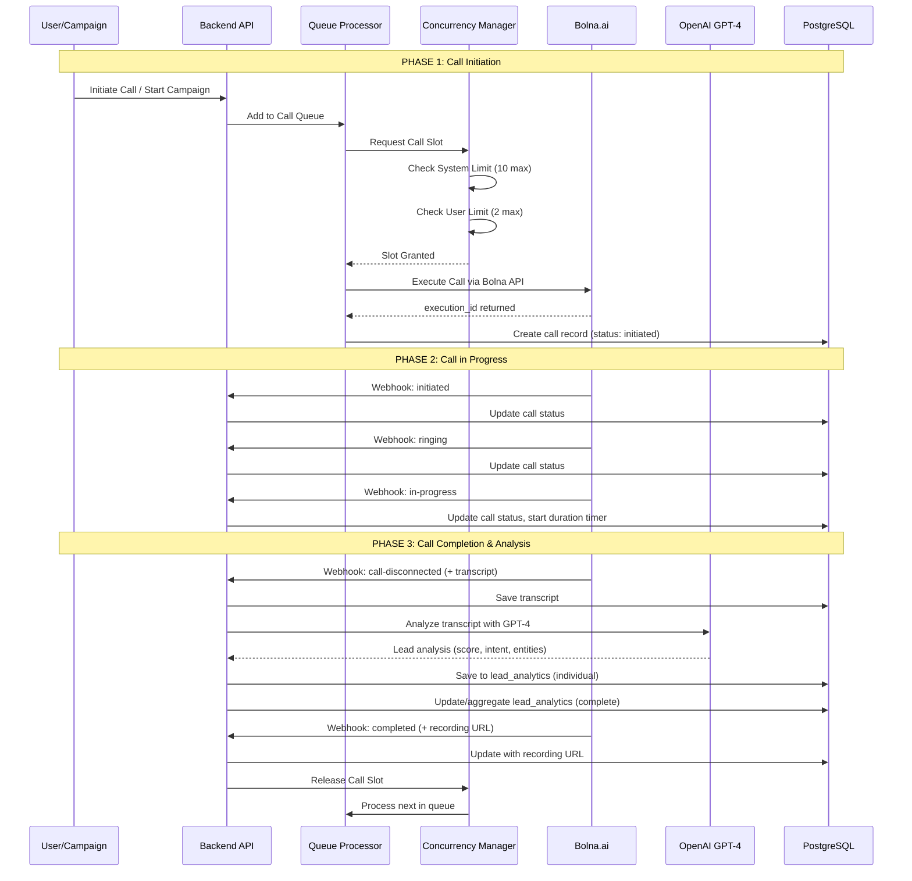
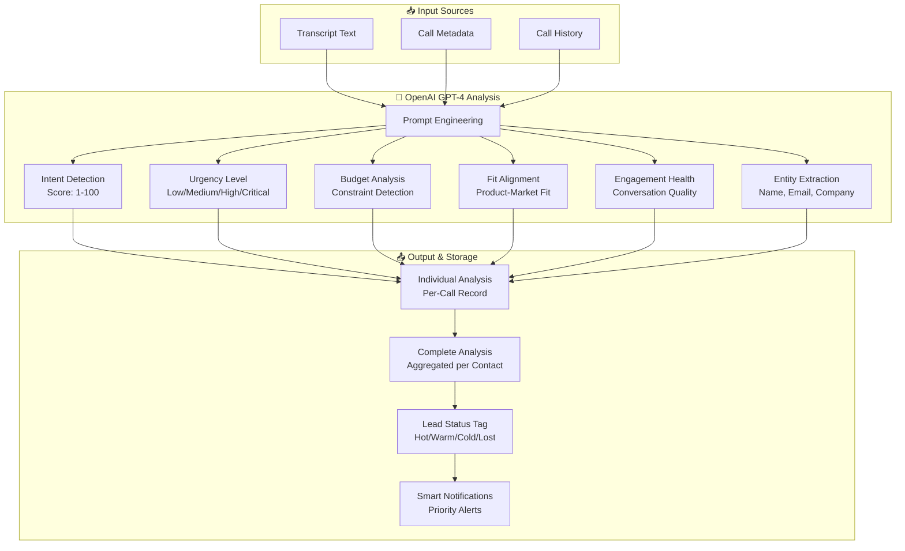
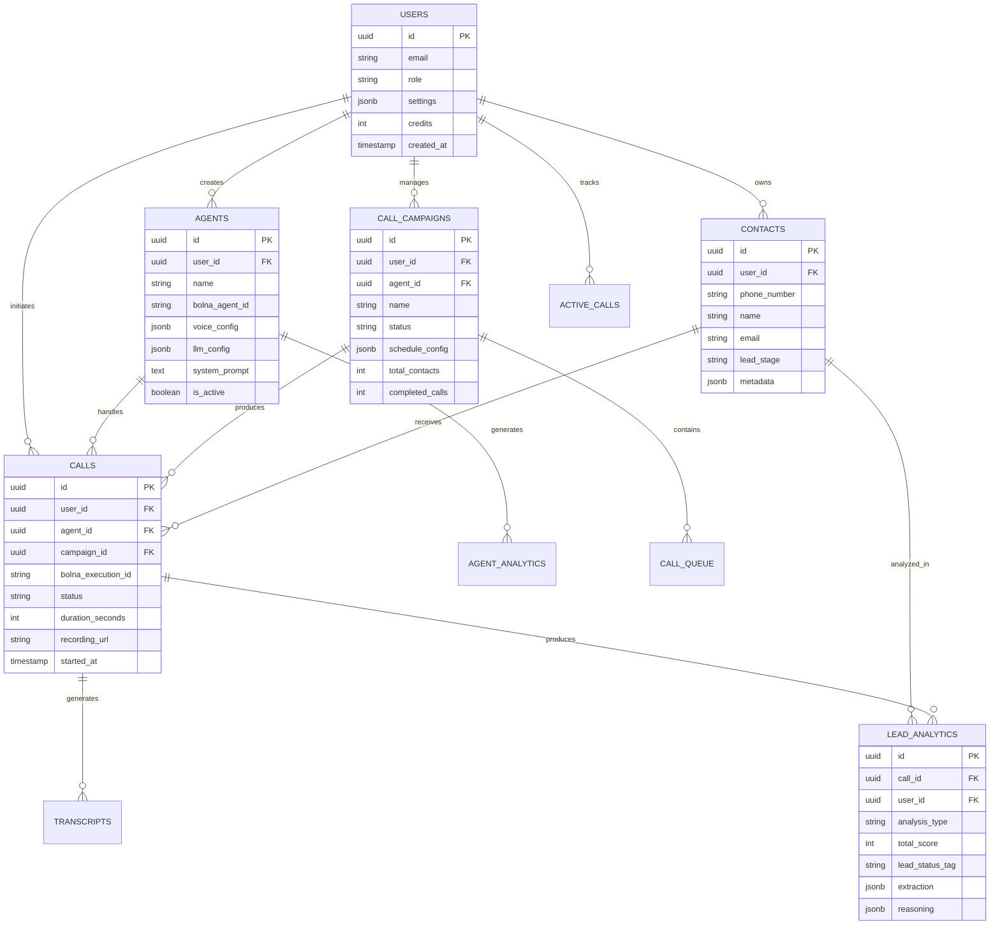

# Cold Email Template - AI Calling Agent CRM Platform

---

## 📧 EMAIL TEMPLATE

**Subject Line Options (Choose One):**
1. `Full-Stack Developer | Built Multi-Tenant AI Calling CRM from Scratch - Microservices, Bolna.ai, OpenAI`
2. `Seeking Full-Stack Role | Enterprise-Grade AI Calling Platform Architect - 5 Paid Clients Onboarded`
3. `Multi-Tenant SaaS with Voice AI Integration | Full-Stack Developer Open to Opportunities`

---

### Email Body

---

**Dear [Hiring Manager's Name],**

I am writing to express my interest in the Full-Stack Developer position at [Company Name]. I recently completed building a **production-grade, multi-tenant AI Calling Agent CRM platform** entirely from scratch as the sole developer at SniperThink, which has already onboarded **5 paying clients** and processes **100+ AI-powered calls**.

I believe my hands-on experience architecting complex systems with **microservice patterns, voice AI integrations, and real-time data processing** aligns closely with the technical challenges your team tackles.

---

### 🏗️ Project Overview: AI Calling Agent CRM

A comprehensive **B2B SaaS platform** enabling businesses to automate outbound/inbound calling campaigns using AI voice agents. The system handles the complete lifecycle from lead ingestion to AI-powered call execution, real-time transcript analysis, and intelligent lead scoring.

**Key Metrics:**
- ✅ **5 Paid Clients** onboarded with ongoing negotiations for expansion
- ✅ **100+ AI Calls** processed with complete analytics
- ✅ **3+ Months** of solo development and iteration
- ✅ **30+ Database Tables** with complex relational design
- ✅ **80+ Backend Services** handling various business logic

---

### 🛠️ Technical Stack & Integrations

| Layer | Technology |
|-------|------------|
| **Backend** | Node.js, Express.js, TypeScript |
| **Frontend** | React 18, Vite, TanStack Query, shadcn/ui, Tailwind CSS |
| **Database** | PostgreSQL (Neon Serverless), 30+ normalized tables |
| **Voice AI** | Bolna.ai (Primary), ElevenLabs (Legacy), Twilio, Plivo |
| **AI/ML** | OpenAI GPT-4 (Lead Analysis, Scoring, Extraction) |
| **Messaging** | WhatsApp Business API (Meta), Zoho ZeptoMail |
| **Automation** | n8n (Lead ingestion, custom client workflows) |
| **Infrastructure** | Cloudflare R2 (Storage), Sentry (Error Tracking) |
| **Mobile** | React Native + Expo |

---

### 🏛️ Architecture Deep-Dive

#### Microservices Architecture Pattern

```
┌─────────────────────────────────────────────────────────────────────────────────────┐
│                              CLIENT LAYER                                            │
├─────────────────────────────────────────────────────────────────────────────────────┤
│   [React Web App]          [React Native Mobile]           [n8n Workflows]          │
│      (Port 5173)                (Expo)                    (Lead Automation)         │
└────────────┬───────────────────────┬─────────────────────────────┬──────────────────┘
             │                       │                             │
             ▼                       ▼                             ▼
┌─────────────────────────────────────────────────────────────────────────────────────┐
│                         API GATEWAY & AUTHENTICATION                                 │
├─────────────────────────────────────────────────────────────────────────────────────┤
│   [Main Dashboard Backend - Port 3000]                                               │
│   ├── JWT Authentication Middleware                                                  │
│   ├── Role-Based Access Control (User/Admin/SuperAdmin)                              │
│   ├── Multi-Tenant Data Isolation (user_id filtering)                               │
│   └── Request Validation & Sanitization                                              │
└────────────┬────────────────────────────────────────────────────────────────────────┘
             │
             ├─────────────────────────────────────────────────────────────────────────┐
             │                                                                         │
             ▼                                                                         ▼
┌─────────────────────────────────────┐     ┌─────────────────────────────────────────┐
│      CHAT AGENT SERVER              │     │         EXTERNAL SERVICES               │
│        (Microservice)               │     │                                         │
│         Port 4000                   │     │  ┌─────────────────────────────────┐   │
├─────────────────────────────────────┤     │  │         Bolna.ai                │   │
│  • WhatsApp Template Management     │     │  │   (AI Voice Conversations)      │   │
│  • Meta WhatsApp Business API       │     │  │   - Agent Creation/Management   │   │
│  • Bulk Template Campaigns          │     │  │   - Call Execution              │   │
│  • Google Calendar Integration      │     │  │   - 5-Stage Webhook Lifecycle   │   │
│  • User Token Synchronization       │     │  │   - Recording & Transcripts     │   │
└─────────────────────────────────────┘     │  └─────────────────────────────────┘   │
                                            │                                         │
                                            │  ┌─────────────────────────────────┐   │
                                            │  │         OpenAI GPT-4            │   │
                                            │  │   (Intelligence Layer)          │   │
                                            │  │   - Transcript Analysis         │   │
                                            │  │   - Lead Scoring (1-100)        │   │
                                            │  │   - Intent/Urgency Detection    │   │
                                            │  │   - Entity Extraction           │   │
                                            │  └─────────────────────────────────┘   │
                                            │                                         │
                                            │  ┌─────────────────────────────────┐   │
                                            │  │    Twilio / Plivo               │   │
                                            │  │   (Telephony Providers)         │   │
                                            │  │   - Phone Number Management     │   │
                                            │  │   - Call Routing                │   │
                                            │  │   - SMS Capabilities            │   │
                                            │  └─────────────────────────────────┘   │
                                            │                                         │
                                            │  ┌─────────────────────────────────┐   │
                                            │  │       Zoho ZeptoMail            │   │
                                            │  │   (Transactional Email)         │   │
                                            │  │   - Follow-up Emails            │   │
                                            │  │   - Meeting Confirmations       │   │
                                            │  │   - Campaign Notifications      │   │
                                            │  └─────────────────────────────────┘   │
                                            │                                         │
                                            │  ┌─────────────────────────────────┐   │
                                            │  │           n8n                   │   │
                                            │  │   (Workflow Automation)         │   │
                                            │  │   - Email Lead Ingestion        │   │
                                            │  │   - Custom Client Workflows     │   │
                                            │  │   - Regex + Custom Code Parsing │   │
                                            │  └─────────────────────────────────┘   │
                                            └─────────────────────────────────────────┘
```

---

### 🔄 Call Lifecycle & Webhook Processing Flow



---

### 📊 Lead Analysis Engine Flow



---

### 🔄 Campaign Processing Architecture

```mermaid
flowchart LR
    subgraph CAMPAIGN ["📋 Campaign Management"]
        CC[Create Campaign]
        CU[Contact Upload<br/>CSV/Bulk Import]
        CS[Campaign Scheduler]
    end

    subgraph QUEUE ["📬 Queue System"]
        QP[Queue Processor<br/>10s Interval]
        GL[Global Lock<br/>Prevents Race Conditions]
        UL[User Limits<br/>2 concurrent/user]
        SL[System Limits<br/>10 concurrent total]
    end

    subgraph EXECUTION ["🚀 Execution Layer"]
        BN[Bolna.ai API]
        AC[Active Calls Table<br/>Real-time Tracking]
        WH[Webhook Handler<br/>5-Stage Lifecycle]
    end

    subgraph ANALYTICS ["📈 Analytics"]
        LA[Lead Analytics]
        AA[Agent Analytics]
        DA[Dashboard KPIs]
    end

    CC --> CU
    CU --> CS
    CS --> QP
    QP --> GL
    GL --> UL
    UL --> SL
    SL --> BN
    BN --> AC
    AC --> WH
    WH --> LA
    LA --> AA
    AA --> DA
```



---

### 🗃️ Database Schema Overview



---

### 🔧 Technical Complexity & Challenges Solved

#### 1. **Voice AI Provider Migration (ElevenLabs → Bolna.ai)**
- Migrated entire voice AI infrastructure without service disruption
- Redesigned webhook processing for Bolna's 5-stage lifecycle
- Implemented new agent configuration schema while maintaining backward compatibility

#### 2. **Bulletproof Concurrency Management**
```typescript
// Problem: Race conditions in call slot allocation
// Solution: Global lock + per-user slots with guaranteed cleanup

class ConcurrencyManager {
  // System-wide: Max 10 concurrent calls across all users
  // Per-user: Max 2 concurrent calls per tenant
  // Priority: Direct calls > Campaign calls
  
  async acquireSlot(userId: string, callType: 'direct' | 'campaign'): Promise<boolean>
  async releaseSlot(callId: string): Promise<void>
}
```

#### 3. **Dual Lead Analytics Pattern**
- **Individual Analysis**: Per-call insights keyed by `call_id`
- **Complete Analysis**: Aggregated contact profile keyed by `user_id + phone_number`
- Enables both call-level debugging and contact-level decision making

#### 4. **Multi-Tenant Data Isolation**
Every database query enforces `user_id` filtering to prevent cross-tenant data leakage:
```typescript
// ✅ Correct: Tenant-isolated query
await pool.query('SELECT * FROM agents WHERE id = $1 AND user_id = $2', [id, userId]);
```

#### 5. **n8n Custom Integration Pipeline**
- General workflow automation for lead ingestion from email
- Custom regex + code implementations per client (2-day delivery)
- Handles non-standard lead formats from various sources

#### 6. **Microservice Communication Pattern**
- Main Dashboard proxies WhatsApp requests to Chat Agent Server
- Maintains single source of truth for Meta API credentials
- Google Calendar token synchronization across services

---

### 📁 Codebase Structure

```
📦 AI-Calling-Agent-CRM
├── 📂 backend/src/
│   ├── 📂 services/          # 80+ business logic services
│   │   ├── webhookService.ts           # 2000+ LOC - Core webhook handler
│   │   ├── QueueProcessorService.ts    # Campaign queue management
│   │   ├── bolnaService.ts             # Bolna.ai API client
│   │   ├── openaiExtractionService.ts  # Lead analysis engine
│   │   ├── ConcurrencyManager.ts       # Call slot management
│   │   ├── leadAnalyticsService.ts     # Dual analysis pattern
│   │   ├── chatAgentService.ts         # WhatsApp proxy layer
│   │   └── ...
│   ├── 📂 models/            # 20+ TypeScript data models
│   ├── 📂 routes/            # RESTful API endpoints
│   ├── 📂 middleware/        # Auth, validation, error handling
│   └── 📂 migrations/        # SQL migration scripts
│
├── 📂 Frontend/src/
│   ├── 📂 components/        # shadcn/ui based components
│   ├── 📂 pages/             # Route-based page components
│   ├── 📂 hooks/             # TanStack Query hooks
│   ├── 📂 services/          # API client with retry logic
│   └── 📂 contexts/          # React Context providers
│
├── 📂 mobile/                # React Native + Expo app
│
└── 📂 Chat-Agent-Server/     # Separate microservice (Port 4000)
    ├── WhatsApp Template APIs
    ├── Meta Business API Integration
    └── Google Calendar Sync
```

---

### 🎯 Product Lifecycle Summary

| Phase | Duration | Key Deliverables |
|-------|----------|------------------|
| **Discovery & Design** | Week 1-2 | Architecture design, database schema, API contracts |
| **Core Backend** | Week 3-6 | Authentication, multi-tenancy, agent management, call execution |
| **Voice AI Integration** | Week 7-8 | ElevenLabs integration, webhook handling, transcript processing |
| **Frontend Development** | Week 9-10 | React dashboard, campaign management, analytics views |
| **AI Analysis Engine** | Week 11 | OpenAI integration, lead scoring, entity extraction |
| **Migration to Bolna** | Week 12 | Complete voice provider migration, new webhook architecture |
| **Chat Agent Microservice** | Week 13+ | WhatsApp integration, n8n workflows, client customizations |

---

### 🔗 Live Resources

- **GitHub Repository**: [github.com/sddhantjaiii/Calling-agent-with-bolna](https://github.com/sddhantjaiii/Calling-agent-with-bolna)
- **Portfolio**: [Available on request]
- **LinkedIn**: [Your LinkedIn URL]

---

I would welcome the opportunity to discuss how my experience building production-grade, enterprise systems could contribute to [Company Name]'s engineering initiatives. I am available for a technical discussion at your earliest convenience.

Thank you for considering my application.

**Best regards,**

**Siddhant Jaiswal**  
Full-Stack Developer  
[Your Email]  
[Your Phone Number]

---

---

## 📝 CUSTOMIZATION NOTES

### Placeholder Fields to Replace:
- `[Hiring Manager's Name]` - Research on LinkedIn
- `[Company Name]` - Target company
- `[Your LinkedIn URL]` - Your profile
- `[Your Email]` - Contact email
- `[Your Phone Number]` - Contact phone

### Tone Adjustments:
- **For Startups**: Emphasize speed of delivery, full-stack capabilities, solo ownership
- **For Enterprises**: Highlight scalability, security (multi-tenancy), production metrics
- **For AI Companies**: Focus on OpenAI integration, voice AI migration, lead scoring engine

### Length Variations:

**Short Version (2 paragraphs):**
> I built a multi-tenant AI Calling CRM from scratch that has onboarded 5 paying clients and processes 100+ AI calls. The system integrates Bolna.ai for voice, OpenAI for lead analysis, and follows a microservices pattern with a separate Chat Agent server for WhatsApp. I'm seeking a Full-Stack role where I can apply this production-system experience. GitHub: [link]

**Medium Version (Email body only, skip diagrams):**
Use the email body section without the Mermaid diagrams for LinkedIn InMail or shorter emails.

---

## 🎨 MERMAID DIAGRAMS (Copy-Paste Ready)

All diagrams above are written in Mermaid syntax. To use them:
1. Copy the code block content
2. Paste into any Mermaid-compatible renderer (GitHub README, Notion, Mermaid Live Editor)
3. Diagrams will render automatically

---

## 📊 QUICK STATS FOR CONVERSATIONS

| Metric | Value |
|--------|-------|
| Development Duration | 3+ months |
| Team Size | Solo developer |
| Paying Clients | 5 |
| Calls Processed | 100+ |
| Database Tables | 30+ |
| Backend Services | 80+ |
| Voice Providers Integrated | 3 (Bolna, ElevenLabs, Twilio/Plivo) |
| AI Integrations | OpenAI GPT-4, Bolna AI |
| Lines of Code (Core Services) | 10,000+ |
| Webhook Handler Complexity | 2000+ LOC, 5-stage lifecycle |

---

*Last Updated: January 28, 2026*
